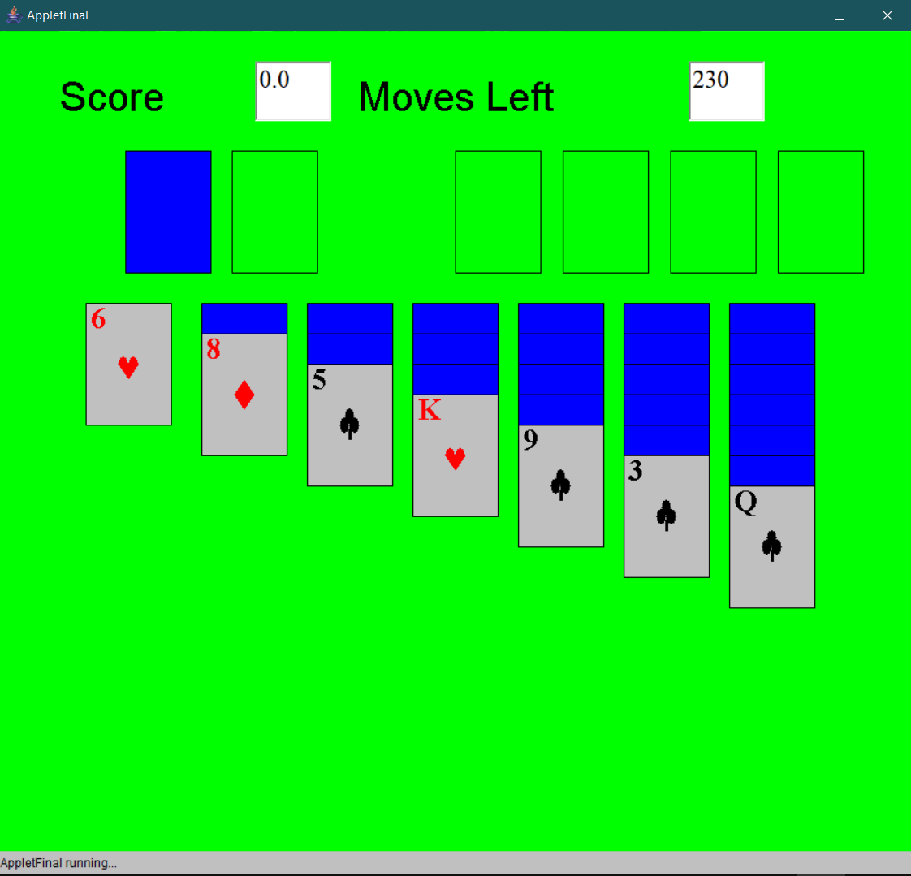

# Klondike Solitaire

A remake of Klondike Solitaire made in java 1.4 and java.awt.

This version of Klondike has the same rules as standard Klondike Solitaire.

Three difficulties are provided in this remake: easy, normal, and hard.

You will have 300 moves on easy, 230 moves on normal, and 160 moves on hard. There is also a free-play mode where you can play with game without worrying about how many moves you can make.

## Demo

## Running Klondike Solitaire

**Dependencies:**
- Ready to Program 1.7 (Proprietary Java IDE, Freeware)

1. Download and install Ready to Program (RTP)
2. Open RTP and open AppletFinal.java
3. Click "Run" on the top left corner (RTP may ask you to confirm some settings; use the default settings)

**Ready to Program 1.7 can be downloaded at: http://compsci.ca/holtsoft/**

RTP is an IDE made by Holtsoft (now defunct) intended to be used for Ontario high schools.
Ready to Program 1.7 contains java 1.4.2, along with several proprietary java packages.

From my testing of RTP, the proprietary java packages are only the **output to console methods, i.e., print()**.
However, my remake of Klondike Solitare has not been verified to work on a non-RTP java 1.4.2 environment.
